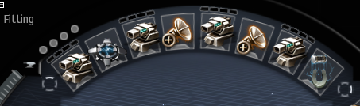

# Lunne’s Guide on How to Not Die in your Marauder

---

## Synopsis:

Through this document whether or not you have flown High Sec incursions, we will work with you from the ground up on a few ways to maximize your DPS and time in bastion as that is the goal of flying a marauder as that literally doubles your gun dps.

You may feel scared to bastion initially, however read this guide and it will explain not only dangerous situations, but also tell you the safest ways to bastion and maximize your DPS output.

The biggest part of this is to ask your FC for help if you are not sure about something and don’t feel safe, they will clarify and help you feel safer in those situations so you can click the sexy button :D

← Sexy Button <3

How to Fly your Marauder Safely and Effectively

### Step 1: Space your guns for contest heat damage

This means they want your guns to look something like this:

This means that when you overheat modules heat will spread from
Gun → Utility → Gun → etc…
This means that in a contest you will be able to heat longer and maximize your DPS further.

### Step 2: What does the Blue Pill Do?

Synth Blue Pill is an amazing drug to carry in your marauder for multiple reasons including:
● It’s a flat 6% bonus to your shield booster.
● There is no chance of there being a negative side effect meaning no capacitor penalties or shield hit point penalty like the other variants of blue pill, which can heavily affect your ability to tank.

This means that you are getting free tank out of your marauder, and this is a requirement for you to fly your Kronos in a WTM fleet, however other marauder can choose to use different drugs such as MJD paladins using Mindflood due to their guns using a large amount of cap. So ensure that you have enough drugs in your cargo for the duration that you are going to be flying in fleet, whether they be DPS drugs, Application Drugs, or Tank/Cap Drugs.

Along the lines of drugs:
Some recommended drugs are already in the cargo hold listed in the fitting website, these include:

- Pyrolancea Dose 2 (Higher levels up to Dose 4 are nice to have for contests, however casually running Dose 2 is good to have as well)

- Synth Blue Pill - good for marauders with shield Booster (Kronos, Vargur, Golem) as you can tank more and use less cap overall and these ships don't really have anything overly important to use in this drug slot.

- Synth Mindflood - Good for Paladins to use as it makes you more cap stable with your guns (You will notice this will become an issue)

\*Synth Drop/Frentix - Can be used interchangeably depending on your playstyle. For these it is best to experiment but ensure that you are only using the synth variation.

### Step 3: How to Bastion (When to and How to Tank)

When you activate bastion on your marauder you are no longer able to receive remote reps from the fleet. This means that if you pull aggro while in bastion you have to be able to tank long enough yourself in bastion to exit bastion to receive reps. However, in saying this we want you to be in bastion as much as possible to maximize your DPS as that is the main reason to fly a marauder.

After aggro has switched/established and it's not split or on you, you are safe to bastion for 2 cycles (1 minute for a switch, Bastion cycle is 30 seconds). However the only time you do not bastion for 2 cycles is when you're not sure how far into the 1 minute timer the aggro is, and just do 1 cycle. If you are flaying a pally, listen to the FC and pay attention if there are low kronos numbers in fleet as you may pull switches so at that point pay attention to your cycles.

The only other times that it is required that they be out of bastion is for wave spawns and especially Outuni Messen Spawns, for obvious reasons. (For those that are new to incursions, the Outuni is a BS that has a capital size neut that applies perfectly to subcaps, this means that your shield booster becomes ineffective along with your shield hardeners due to not having cap to activate them).

If you pull aggro in bastion, you will need to understand how to survive and most of this is determined by yourself but the backseat needs to be able to inform you of what to do if you aren't sure.

If you are flying a MJD Pally, and you pull the aggro, no matter how much time is left in bastion, it is highly recommended that you overheat, with the combined resistance bonus of bastion and your heated hardeners you gain a decent chunk more EHP which means you can come out of bastion in shield rather than Armor. However, you can refit the Microwarp Drive in TCRC’s and NRF’s for a shield booster increasing your tank as these sites don’t need you to burn and having a shield booster is nice to have however we like you to have the MJD more :D.

If it is a large wave spawn and you get the aggro:

TPPH Room 3, Wave 2 Initial
NRF 4th Wave Initial or Switch
TCRC Switches at any point.

In all of these situations, you will have to overheat both hardeners and the Shield Booster to give you the best chance of survival. There is nothing to worry about if you get a switch in bastion, however if there is a substantial amount of DPS remaining on grid you may have to heat until you leave bastion. You will easily survive, if you do not overbastion with aggro.

### Step 5: TCRC Refitting

When going to a TCRC it is important for a pilot to refit to a MJD (This is even important for non-marauder pilots).

You do not need to click on the nestor as long as you are within 5KM of the nestor you can refit by clicking and dragging from the fitting window to your cargo or clicking and dragging from next to the capacitor wheel if you have display modules on.

---

_If you have any questions about this guide, please contact me on discord either in the WTM discord by pinging “@Thedizzman101#8008” in general channel._

_OR_

_DM Me on discord: Thedizzman101#8008_

_All of this is done for the benefit of making the process easier for command core members and more streamlined experience for the line pilots._

_Thank you for reading my TED Talk <3_
