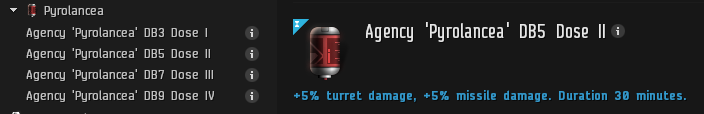
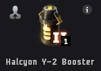
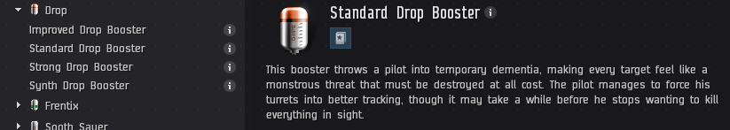
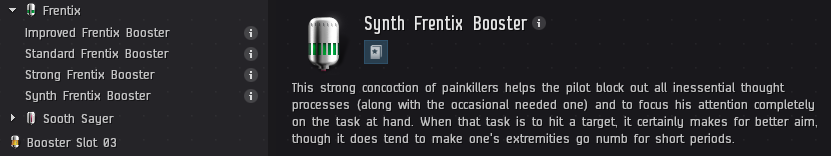
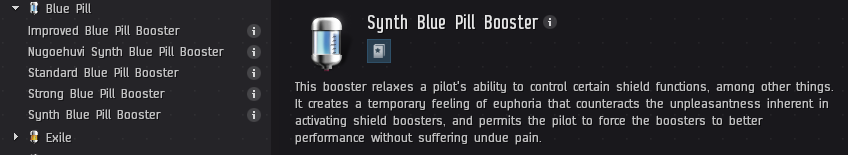
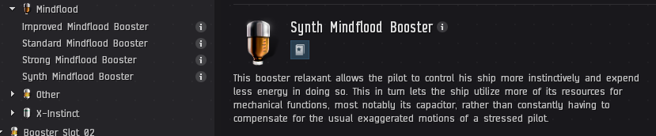

# How to Not Die in your Marauder

---

## Synopsis

This guide will give you the basics of how to not to die and be effective, it is a baseline not a goal, you pilot your ship and you are responsible for it, you should always try to improve. **IF IN DOUBT ASK THE FC**, we dont bite to much, but we do expect you to apply what you have learned. Whether or not you have flown High Sec incursions before, we will work with you from the ground up on a few ways to maximize your DPS and time in bastion as that is the goal of flying a marauder.

You may feel scared to bastion initially, however read this guide and it will explain dangerous situations, and also tell you the safest ways to bastion and maximize your DPS output.

The biggest part of this is to ask your FC for help if you are not sure about something and don’t feel safe, they will clarify and help you feel safer in those situations so you can click the sexy button :D

← Sexy Button <3

## How to fly your marauder safely and effectively

### Step 1: Space your guns for contests

This will spread heat damage from Gun → Utility → Gun → etc… and in a contest you will be able to heat longer. You want your highslots to look something like this:

### Step 2: Use drugs

There are many types of different drugs, when possible we ask you to use the bare minimum to be effective. Use what works well with your chosen ship.

- Pyrolancea gives turret DPS for all weapons (Always run DB3 as a minimum)

---

- Halcyon drugs or the "login" drugs give multiple bonuses but as a marauder you should prioritise DPS when you can. But best of all, they are **free** and will expire unless used.

---

- Drop gives tracking bonuses for turrets which will give you "applied DPS" but can come with drawbacks using the stonger versions. The stronger versions should only really be used with **ARMOR** tanked ships. **CHECK BEFORE USE!**

---

- Synth Frentix gives optimal range bonuses for turrets which will give you "applied DPS" but can come with drawbacks using the stonger versions, therefore you should **ONLY USE THE SYNTH** version of this drug.

---

- Synth Blue Pill gives increased shield boost amount thus improving your shield tank, this is great for any shield tanked ships as it has no drawbacks. We do not recommend stronger versions due to drawbacks.

---

- Synth Mindflood gives cap recharge, great if you have poor capacitor skills and keeps you firing those guns.

---

### Step 3: How to bastion (when to and how to tank)

When you activate bastion on your marauder you are no longer able to receive remote reps from the fleet. This means that if you pull aggro while in bastion you have to be able to tank long enough to exit bastion and receive reps. However, this directly contradicts our ethos of "we want you to be in bastion as much as possible" so understanding when to bastion is key. One of the main things to listen for in fleet is the word **"switch"** as detailed below.

Aggro will **switch** every minute or 60 seconds. Once aggro has switched/established and it's not split or on you, you are safe to bastion for 1 cycle. If for any reason you are not sure when a switch has happened or you missed it, do not bastion until you know when the next switch has happened, if your not sure ASK! If you are flaying a paladin, listen to the FC and pay attention as low kronos numbers in fleet may lead to you pulling aggro so pay attention to your cycles. For shield tanked ships its important to broadcast cap if you need it, if your tank turns off you will explode very quickly, you cannot recieve cap during bastion but broadcasting for it will ensure everyone knows you will need it when you come out of bastion.

There will always be odd scenarios or mistakes in fleet, the FC will be doing their best to ensure this is kept to a minimum but you can yourself pay attention and ensure your own safety by being aware of whats going on. If the FCs booster is not correctly positioned to pull aggro then it is advised to not be in bastion when new waves spawn incase you get the initial aggro.

If you pull aggro in bastion:
- The first thing you should do is broadcast your tank type.

- Secondly give the FC a voice over of how long until your bastion cycle is going to end. Counting down the final 10s or so will aid the logi in applying reps the moment you come out of bastion if its a close call.

- Thirdly overheat any active tank modules your ship might be fitted with

Giving this information is key to the FC as they cannot make decisions to aid in your survival without it. **DONT DIE IN SILENCE!**.

There are other small things you can do to make life easier for everyone, such as broadcasting your tank type again when you come out of bastion, not broadcasting for troll aggro directly after a switch. Using your battle reps on other marauders when logi are not on grid/in range, it could be you that needs them so use them for others when its neccessary and others will return the favor when you need it.

### Step 5: TCRC entry & NRF entry.

Entrances to TCRCs are usually very structured, but there are occasions things dont go to plan. It may seem obvious, but if you are in doubt, dont bastion and ask if its safe to do so. Once aggro is established if you dont have any specific roles you bastion for one cycle on the beacon and shoot:

- Deltole
- Outuni
- UNTAGGED Ostingele

Once the above NPCs are dead you will MJD to the tower and proceed to do your second bastion cycle, the fleet will always have a "lightning rod" pilot who will effectively be pre-determining where the aggro will go, but again, pay attention to when switches happen and bastion timely to ensure your own safety.

Entrance to NRFs are only dangerous should you not pay attention and MJD blindly into your anchor spot. So when you enter an NRF after checking for phenomena, assess the grid, if the final wave is about to spawn, burn into the site, if you have any doubt as to your safety, **burn into site rather than MJD**.